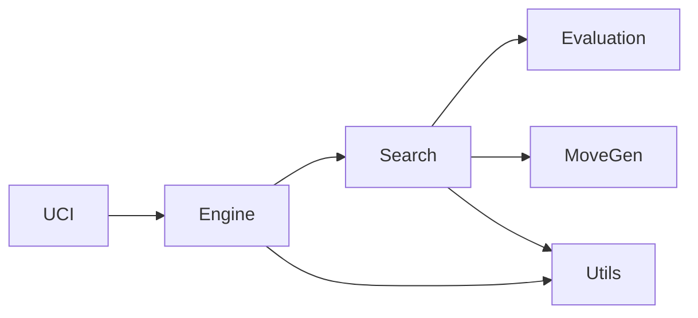

# Blocky Chess

`Blocky Chess` is a chess engine developed in Rust, designed with a modular architecture that facilitates extensibility and maintenance. It implements the Universal Chess Interface (UCI) protocol, allowing it to interact with various chess graphical user interfaces (GUIs).

This project serves as an exploration of applying the **Hexagonal Architecture (Ports and Adapters)** principles beyond typical web applications. While often associated with web development for isolating business logic from frameworks and databases, Hexagonal Architecture is a powerful paradigm for any software system where the core domain needs to be independent of external concerns. `Blocky Chess` showcases how this architecture can lead to a robust, testable, and adaptable core logic, even in a command-line driven application like a chess engine. This approach ensures that the engine's core chess logic remains pristine and easily swappable with different interfaces or storage mechanisms in the future, proving its versatility.

## Key Features

- **Complete Chess Engine**: Includes board position management, legal move generation, position evaluation, and a move search algorithm.
- **UCI Support**: Standard communication with chess GUIs via the UCI protocol.
- **Modularity**: Code organized into well-defined components for greater clarity and ease of development.
- **`shakmaty` Usage**: Leverages the powerful `shakmaty` library for fundamental chess logic.

## Project Architecture

The architecture of `Blocky Chess` is based on a modular design, where each main functionality of the engine is encapsulated in its own well-defined "block" or module. This approach promotes separation of concerns and adheres to key software design principles, such as the Single Responsibility Principle (SRP), Open/Closed Principle (OCP), Liskov Substitution Principle (LSP), and Dependency Inversion Principle (DIP).

The main modules are:

- **`engine.rs`**: Contains the core logic of the chess engine, managing the board position and orchestrating the move search process.
- **`evaluation/`**: Module dedicated to functions that evaluate the "goodness" of a position on the board. It allows for easy addition of new evaluation strategies.
- **`movegen/`**: Responsible for generating all possible legal moves from a given position.
- **`search/`**: Houses the move search algorithms (currently Alpha-Beta), which explore the game tree to find the best move.
- **`uci.rs`**: Implements the interface for the UCI protocol, handling input and output communication with chess GUIs.
- **`utils/`**: Contains utilities and constants shared by other modules.



### Applied SOLID Principles and Hexagonal Architecture

The project's modularity and design choices are deeply rooted in SOLID principles, which align perfectly with the goals of Hexagonal Architecture (Ports and Adapters). Here's how these principles are applied, using a nomenclature adapted to the chess engine domain:

- **Single Responsibility Principle (SRP)**: Each "component" or "block" of the engine has a single, well-defined responsibility. For example, the `Move Generator` (`movegen/`) is solely responsible for producing legal moves, the `Position Evaluator` (`evaluation/`) for assessing board states, and the `UCI Adapter` (`uci.rs`) for handling the communication protocol. This clear separation ensures that changes to the move generation logic, for instance, do not impact the evaluation or communication layers.
- **Open/Closed Principle (OCP)**: The core `Chess Engine` (`engine.rs`) is designed to be extensible without requiring modifications to its existing code. It defines "ports" (interfaces) for its dependencies. For example, the `Engine` accepts any `Search Algorithm` that implements the `Search` trait. This allows new search strategies (e.g., Minimax, PVS) to be "plugged in" as new "adapters" without altering the `Engine`'s core logic. Similarly, different `Evaluation Functions` or `Move Generators` can be swapped.
- **Liskov Substitution Principle (LSP)**: This principle is naturally supported by Rust's trait system, which forms the basis of our "ports." Any concrete `Search Algorithm` (e.g., `AlphaBetaSearch`) that implements the `Search` trait can be substituted for `Box<dyn Search>` within the `Engine` without affecting the correctness of the program. This ensures that different search implementations can be used interchangeably, as long as they adhere to the `Search` "port" contract.
- **Dependency Inversion Principle (DIP)**: High-level components, such as the `Chess Engine` (`engine.rs`), do not depend on low-level implementation details (like a specific `Alpha-Beta Search` algorithm). Instead, both depend on abstractions (traits in Rust). The `Engine` depends on the `Search` trait (an abstraction/port), and the `AlphaBetaSearch` (a low-level adapter) implements this trait. This inverts the traditional dependency flow, promoting loose coupling and making the core engine independent of its specific "drivers" or "driven" components.
- **Interface Segregation Principle (ISP)**: While `Blocky Chess` currently has one primary "port" (`Search` trait), its design implicitly follows ISP by keeping this trait focused. The `Search` trait defines only the necessary methods for a search algorithm. If the engine were to expand with other external interactions (e.g., persistent storage for game history), new, specific traits (ports) would be introduced, ensuring that "adapters" only implement the interfaces relevant to their specific concerns, avoiding bloated interfaces.

This "blocky" architecture not only justifies the project's name but also makes it robust, flexible, and easy to maintain and expand.

## How to Run

To compile and run `Blocky Chess`, make sure you have Rust installed. Then, you can use the following commands in the project root:

```bash
# Compile the project
cargo build --release

# Run the engine (it will communicate via standard input/output with a UCI GUI)
cargo run --release
```
